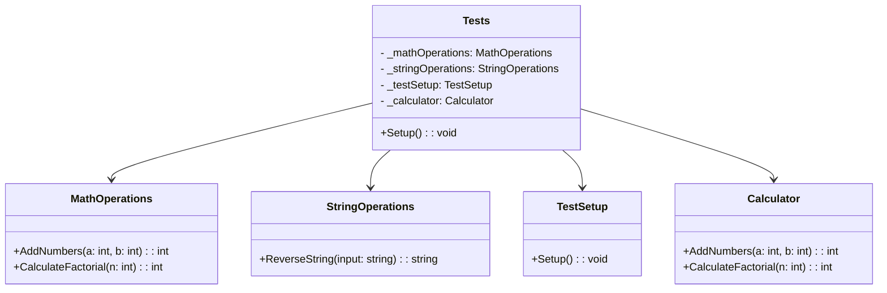

```mermaid
classDiagram
    class Tests {
        - _mathOperations: MathOperations
        - _stringOperations: StringOperations
        - _testSetup: TestSetup
        - _calculator: Calculator
        +Setup(): void
    }
    
    class MathOperations {
        +AddNumbers(a: int, b: int): int
        +CalculateFactorial(n: int): int
    }
    
    class StringOperations {
        +ReverseString(input: string): string
    }
    
    class TestSetup {
        +Setup(): void
    }

    class Calculator {
        +AddNumbers(a: int, b: int): int
        +CalculateFactorial(n: int): int
    }
    
    Tests --> MathOperations
    Tests --> StringOperations
    Tests --> TestSetup
    Tests --> Calculator
```
